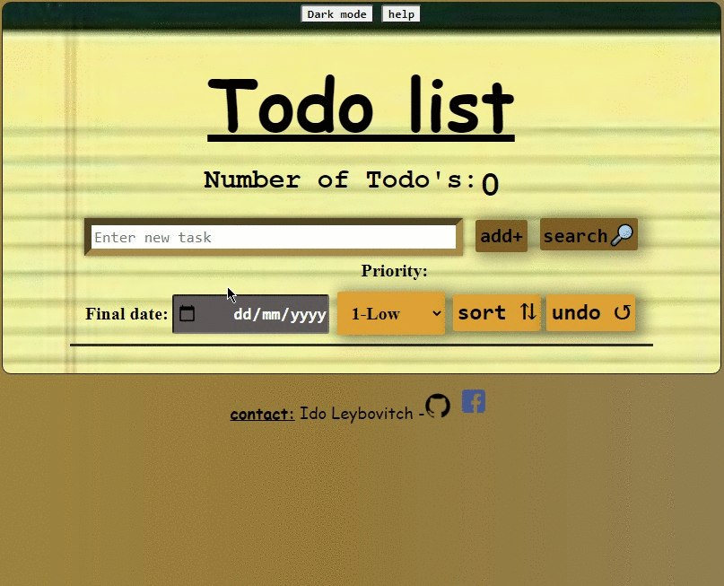
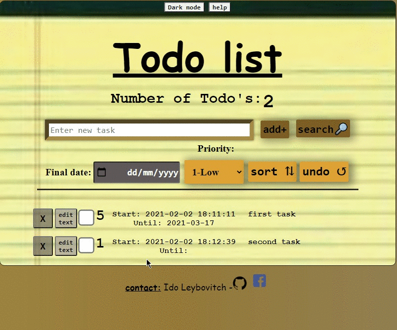
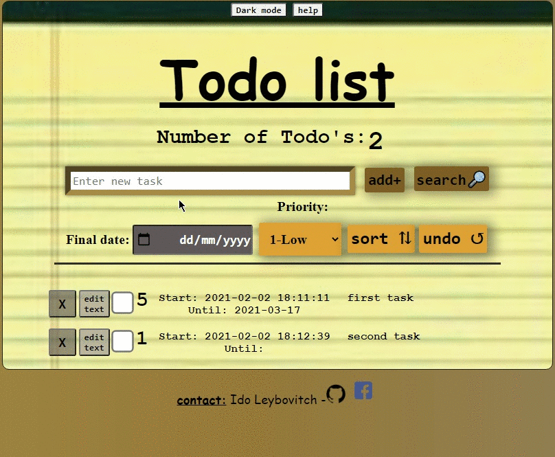
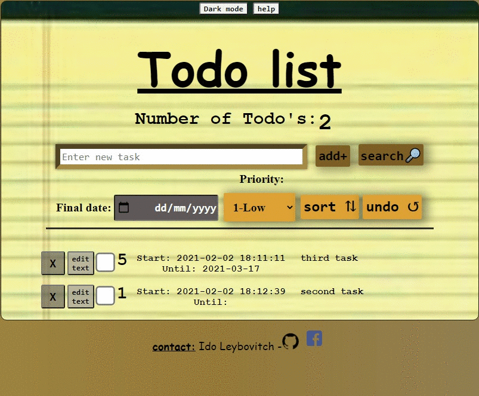
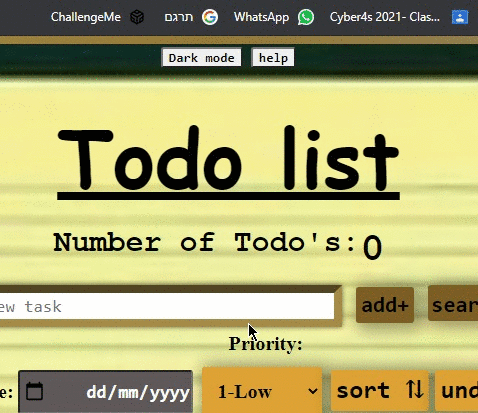
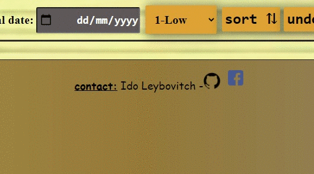

# !Pre Course final Project - Todo List 📋

## Links

- Github-page: https://ido-leybo.github.io/pre-course-2021-final-boilerplate/src/

**Bonuses:**

- Delete button: https://www.w3schools.com/jsref/met_element_remove.asp

- Loading spinner: _ https://www.w3schools.com/howto/howto_css_loader.asp
  _ https://codeburst.io/how-to-create-a-simple-css-loading-spinner-make-it-accessible-e5c83c2e464c

- Search button: https://stackoverflow.com/questions/18167236/simple-javascript-search-box

- CheckBox: https://developer.mozilla.org/en-US/docs/Web/HTML/Element/input/checkbox

- Dark mode button: https://css-tricks.com/a-complete-guide-to-dark-mode-on-the-web

- Final date selector: _ https://developer.mozilla.org/en-US/docs/Web/HTML/Element/input/date
  _ https://www.w3schools.com/tags/att_input_type_date.asp

- Drag'n'drop: _ https://www.youtube.com/watch?v=jfYWwQrtzzY
  _ https://developer.mozilla.org/en-US/docs/Web/JavaScript/Reference/Operators/Spread_syntax

- Write test: _ https://www.youtube.com/watch?v=r9HdJ8P6GQI&t=1995s
  _ https://jestjs.io/docs/en/puppeteer

- JsonBin.io

## on the project -

- In this project, I create a Todo List Web Application,

  in which the user can store prioritized _todo tasks_ and view/sort that list,

  and do more things on the tasks and on the list.

  Here is a preview sample of the functionality:

## how to use

- Enter your task to do in the input area.

- Select the end date for the task.

- Select the priority of the task.

- and click on "add" button.

## More features that can be used in the app

**Search button**

- With the help of the button you can search for certain letters or words from the tasks

  and thus access a specific task.

**Edit button**

- With this button you can re-edit the name / text of your tasks

  even after you have already added them to the list

- **example:**

**Drag'n'drop**

- This feature allows you to drag any task to another place on the list

  by clicking on the task and dragging to the desired location

- **example:**

**Mark as done - checkbox**

- You can mark if the task has already been completed

**Delete button**

- With the help of the button you can delete unwanted tasks

  or tasks that have already been performed

**Undo action**

- With this feature you can return a task you deleted or delete a task you added

**Dark mode button**

- If you are more comfortable with a darker theme,

  you can click the button and change the theme

- **example:**

**Help button**

- If you are getting tangled up with the app the button may be able to give you an initial answer

- **example:**

**Loading spinner**

- Until the page loads, a loading spinner will appear to

  illustrate that the site is indeed in the process of loading

- **example:**

**test**

- I write a new test to my web application.

- The test check if אhe delete button actually deletes a task from the list,

  -and whether the new array is saved Without the deleted value.

**JsonBin.io**
